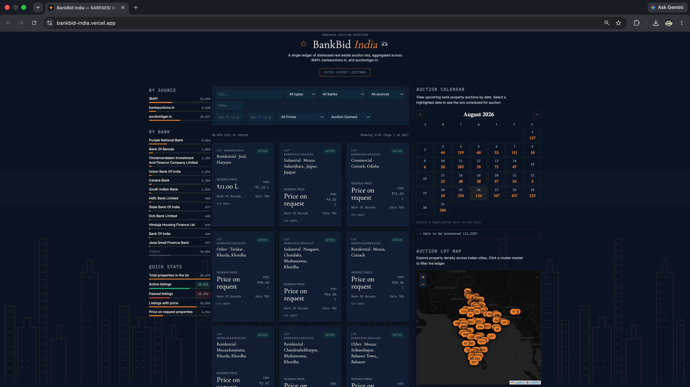

# BankBid India — SARFAESI Auction Register

A unified ledger of distressed real estate auction listings from Indian banks, aggregated across **IBAPI**, **bankauctions.in**, and **auctiontiger.in**.

BankBid India pulls together SARFAESI auction property listings that are otherwise scattered across separate government and private auction portals, de-duplicates them, and presents them in a single searchable, filterable ledger — with a live map, an auction calendar, and reserve-price benchmarking against NHB RESIDEX market data.

**Live app:** https://bankbid-india.vercel.app
**API:** https://bankbid-api.onrender.com

---

## Screenshot

---

## Features

- Live listing fetch from 3 sources via an on-demand "Fetch Latest" button
- Cross-source deduplication — one unified view regardless of source portal
- Search and filter by city, property type, bank, state, price range, and sort order
- Property cards with auction date countdown, reserve price, EMD amount, and live status badges
- Reserve price vs. NHB RESIDEX market rate comparison
- Bank-wise listing counts and an interactive auction calendar
- Leaflet.js map view with city-level clustering and click-to-filter
- Fully responsive — mobile and desktop

## Tech Stack

| Layer | Tool |
|---|---|
| Frontend | Next.js 14, Tailwind CSS |
| Backend | FastAPI (Python) |
| Database | Supabase (PostgreSQL) |
| Map | Leaflet.js (`leaflet` + `react-leaflet`) |
| Hosting (frontend) | Vercel |
| Hosting (backend) | Render |
| Price benchmark | NHB RESIDEX |

## Data Sources

| Source | Coverage |
|---|---|
| IBAPI (ibapi.in) | PSU banks — government portal |
| bankauctions.in | Private banks, HFCs, NBFCs |
| auctiontiger.in | All major PSU + private banks |

All listing data is publicly available under SARFAESI regulatory disclosure requirements. No internal bank systems are accessed.

## Local Development

**Backend**

    pip install -r requirements.txt
    uvicorn app.main:app --reload

**Frontend**

    cd frontend
    npm install
    npm run dev

Set the following environment variables:

Backend (`.env`):

    SUPABASE_URL=your_supabase_url
    SUPABASE_KEY=your_supabase_key
    FRONTEND_URL=http://localhost:3000

Frontend (`frontend/.env.local`):

    NEXT_PUBLIC_API_BASE=http://127.0.0.1:8000

## Author

Built by [Shashank Shekhar](https://github.com/ShashankS69).
